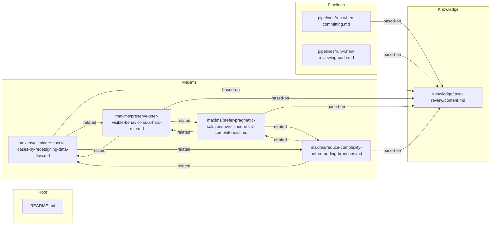

# Pensieve Project Skill (Auto-Maintained)

> Graph and Lifecycle State are auto-updated by `maintain-project-skill.sh`.
> Other sections may be manually edited.

## Lifecycle State
- Last Event: install/init
- Last Note: seeded project skill data via init-project-data.sh

## Routing
- Init: Initialize the `.claude/skills/pensieve/` directory and seed files, perform baseline exploration and code review, and produce candidate items for retention. Idempotent; never overwrites existing data. Tool spec: `<SYSTEM_SKILL_ROOT>/tools/init/_init.md`.
- Upgrade: Version upgrade and plugin configuration key alignment. Only performs version comparison, pulls latest, and cleans up plugin keys; no structural migration or pre-upgrade health check. After upgrade completes, guides the user to manually run doctor. Tool spec: `<SYSTEM_SKILL_ROOT>/tools/upgrade/_upgrade.md`.
- Migrate: Structural migration and legacy residue cleanup. Only handles user data directory migration, key seed file alignment, and historical residue cleanup; no version upgrade or health check grading. Tool spec: `<SYSTEM_SKILL_ROOT>/tools/migrate/_migrate.md`.
- Doctor: Read-only check tool that outputs PASS/PASS_WITH_WARNINGS/FAIL with a MUST_FIX/SHOULD_FIX/INFO evidence list based on README specs. Does not modify user data files. Trigger words: doctor, health check, check. Tool spec: `<SYSTEM_SKILL_ROOT>/tools/doctor/_doctor.md`.
- Self-Improve: Automatically persist reusable conclusions into knowledge/decision/maxim/pipeline during commits or retrospectives, writing directly to user data. Tool spec: `<SYSTEM_SKILL_ROOT>/tools/self-improve/_self-improve.md`.
- Loop: Break complex tasks into verifiable subtasks; main window orchestrates, subagents execute one at a time. Trigger words: loop, use loop, loop mode. Tool spec: `<SYSTEM_SKILL_ROOT>/tools/loop/_loop.md`.
- Graph View: Read the `## Graph` section of this file.

## Project Paths
- Project Root: `/Users/duminxiang/cosmos/go/src/github.com/kl7sn/ai-tools`
- Skill Root: `/Users/duminxiang/cosmos/go/src/github.com/kl7sn/ai-tools/.claude/skills/pensieve`
- Maxims: `/Users/duminxiang/cosmos/go/src/github.com/kl7sn/ai-tools/.claude/skills/pensieve/maxims/`
- Decisions: `/Users/duminxiang/cosmos/go/src/github.com/kl7sn/ai-tools/.claude/skills/pensieve/decisions/`
- Knowledge: `/Users/duminxiang/cosmos/go/src/github.com/kl7sn/ai-tools/.claude/skills/pensieve/knowledge/`
- Pipelines: `/Users/duminxiang/cosmos/go/src/github.com/kl7sn/ai-tools/.claude/skills/pensieve/pipelines/`
- Loop: `/Users/duminxiang/cosmos/go/src/github.com/kl7sn/ai-tools/.claude/skills/pensieve/loop/`

## Graph

<!-- AUTO-GENERATED FILE. DO NOT EDIT MANUALLY. -->
<!-- Generated by: tools/upgrade/scripts/generate-user-data-graph.sh -->

# Pensieve User Data Graph (Auto-Generated)

> This file is auto-generated by a script; no manual maintenance is required.

- Root: `/Users/duminxiang/cosmos/go/src/github.com/kl7sn/ai-tools/.claude/skills/pensieve`
- Categories: maxims, decisions, knowledge, pipelines

### Summary

- Notes scanned: 8
- Links found: 14
- Resolved links: 14
- Unresolved links: 0
